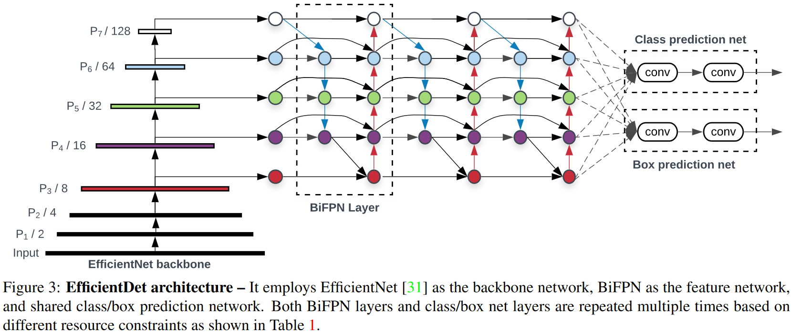
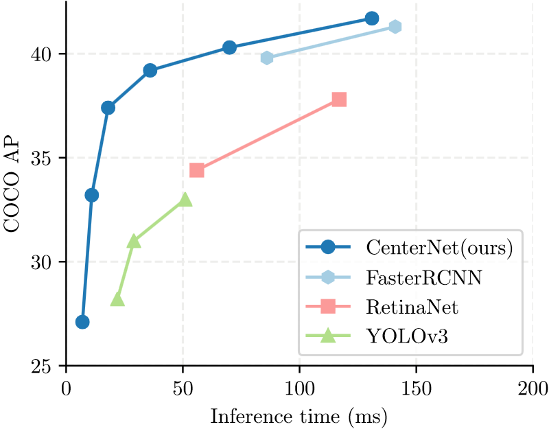
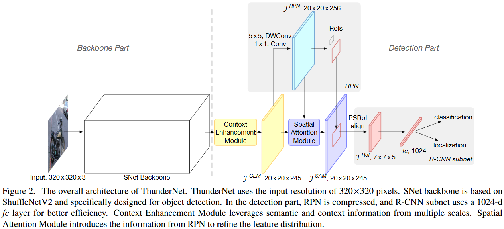

# Новые архитектуры нейросетей

**Under construction...**

Предыдущая статья «[Нейросети. Куда это все движется](https://habr.com/ru/post/482794/)»

TODO list:
  * Посмотрю источники еще на [Papers With Code](https://paperswithcode.com).
  * Посмотрю статьи из [этого списка](https://github.com/zhousy1993/paper). Может, что интересное будет.
  * Есть большой [обзор обнаружения объектов за 20 лет](https://arxiv.org/pdf/1905.05055v2.pdf). Если будет время, то прочитаю его и выделю основные моменты.

В прошлом 2019 году появилось множество новых архитектур нейросетей. В этой статье кратко рассматриваются некоторые наиболее популярные из них.

  - [EfficientNet](#EfficientNet)
  - [EfficientDet](#EfficientDet)
  - [SpineNet](#SpineNet)
  - [CenterNet](#CenterNet)
  - [ThunderNet](#ThunderNet)
  - [CSPNet](#CSPNet)
  - [DetNASNet](#DetNASNet)
  - [SM-NAS](#SM-NAS)
  - [Graph Neural Network](#GNN)
  - [AmoebaNet](#AmoebaNet)
  - [DPM](#DPM)

-------
<a name="EfficientNet" />

**EfficientNet** — класс новых моделей, который получился из изучения масштабирования (скейлинг, scaling) моделей и балансирования между собой глубины и ширины (количества каналов) сети, а также разрешения изображений в сетке. Авторы [оригинальной статьи](https://arxiv.org/abs/1905.11946) предлагают новый метод составного масштабирования, который равномерно масштабирует глубину/ширину/разрешение с фиксированными пропорциями между ними. Из существующего метода «Neural Architecture Search» для создания новых сетей (ссылки на этот метод даны в статье) и своего метода масштабирования получают новый класс моделей под названием EfficientNets.
  * [оригинальная статья](https://arxiv.org/abs/1905.11946)
  * обзор оригинальной статьи [на русском](https://habr.com/ru/company/ods/blog/472672/#4-efficientnet-rethinking-model-scaling-for-convolutional-neural-networks)
  * [исходный код](https://github.com/tensorflow/tpu/tree/master/models/official/efficientnet) для TensorFlow
  * [видео1](https://youtu.be/4U2WO8ObGGU), [видео2](https://youtu.be/3svIm5UC94I), [видео3](https://youtu.be/Vhz0quyvR7I)

-------
<a name="EfficientDet" />

**EfficientDet** применяется для обнаружения объектов. Архитектура показана на рисунке ниже. Состоит из EfficientNet в качестве основы, к которой приделан слой по работе с пирамидой признаков под названием BiFPN, за которым идет «стандартная» сеть вычисления класс/рамка объекта.
  * [оригинальная статья](https://arxiv.org/abs/1911.09070)
  * [исходный код](https://github.com/xuannianz/EfficientDet) для TensorFlow
  * [исходный код](https://github.com/toandaominh1997/EfficientDet.Pytorch) для PyTorch
  * [видео1](https://youtu.be/UCPxzFPdAf8), [видео2](https://youtu.be/11jDC8uZL0E)

Рисунок — Архитектура EfficientDet = EfficientNet + BiFPN + сеть вычисления класс/рамка

-------
<a name="SpineNet" />

**SpineNet** применяется для обнаружения объектов на изображении.
  * [оригинальная статья](https://arxiv.org/abs/1912.05027)
  * исходного кода не нашел
  * [SpineNet online demo](http://zeus.robots.ox.ac.uk/spinenet/demo.html)
  * видео пояснений не нашел

-------
<a name="CenterNet" />

**CenterNet** а также **CornerNet-Lite** считаются мейнстримовыми (2019 год) системами обнаружения объектов. Статья «[Объекты как точки](https://arxiv.org/abs/1904.07850)»
  * [оригинальная статья](https://arxiv.org/abs/1808.01244) по CenterNet
  * [оригинальная статья](https://arxiv.org/abs/1904.08900) по CornerNet-Lite

-------
<a name="ThunderNet" />

**ThunderNet** применяется для обнаружения объектов на изображении.
  * [оригинальная статья](https://arxiv.org/abs/1903.11752)

Рисунок — Архитектура ThunderNet

-------
<a name="CSPNet" />

**CSPNet** (**C**ross **S**tage **P**artial **Net**work) работает на фреймворке [Darknet](https://github.com/AlexeyAB/darknet). Метод применяется не сам по себе, а как *улучшение* уже существующих остаточных нейросетей (residual neural networks). Основная концепция в том, чтобы поток градиента распространялся по разным сетевым путям через разделения потока градиента. Таким образом распространяемая информация о градиенте может иметь большую корреляционную разницу, если переключать этапы конкатенации и перехода. Кроме того, CSPNet может значительно сократить объем вычислений и повысить скорость вывода и точность. Как видно из картинки выше, суть CSPNet в более сложной обработки [пирамид фичей](https://youtu.be/4SxOkIN0CmA?t=495) (feature pyramid network, [FPN](https://arxiv.org/abs/1612.03144)).
  * [оригинальная статья](https://arxiv.org/abs/1911.11929v1)
  * [исходный код](https://github.com/WongKinYiu/CrossStagePartialNetworks)

Рисунок — Пример пирамиды фичей

-------
<a name="DetNASNet" />**DetNASNet**
  * [оригинальная статья](https://arxiv.org/abs/1903.10979)
  * [исходный код](https://github.com/megvii-model/DetNAS)
-------
<a name="SM-NAS" />**SM-NAS**
  * [оригинальная статья](https://arxiv.org/abs/1911.09929)

-------
<a name="GNN" />

**Graph Neural Network** или **нейронная сеть на графе**, где искусственные нейроны — это узлы графа, а соединения между нейронами — это ребра графа. Очень полезны для решения задач машинного обучения на графах. А на графах можно сделать очень многое и даже прововодить обработку изображений. Наиболее популярные библиотеки для машинного обучения на графах: [PyTorch Geometric](https://github.com/rusty1s/pytorch_geometric) для PyTorch, [Graph Nets](https://github.com/deepmind/graph_nets) для TensorFlow, [Deep Graph](https://www.dgl.ai) самая удобная для начала.
  * [простой пример](https://colab.research.google.com/drive/1-lGZyrCaNwq1ub8qdH4_g19erjFz3tU-) в CoLab
  * [видео](https://youtu.be/bA261BF0bdk) by Siraj Raval
  * [документация](https://docs.dgl.ai/tutorials/basics/1_first.html) библиотеки DGL (**D**eep **G**raph **L**ibrary)

-------
<a name="AmoebaNet" />**AmoebaNet**
  * [оригинальная статья](https://arxiv.org/abs/1802.01548)
  * [исходный код](https://github.com/tensorflow/tpu/tree/master/models/official/amoeba_net)

-------
<a name="DPM" />**DPM**, **D**eformable **P**art **M**odel detector, **не** нейросеть.
  * [видео демо](https://youtu.be/3LGGMe1wZGY)

Спасибо за внимание!

**Теги:** машинное обучение, machine learning, нейросеть, искусственная нейронная сеть, artificial neural network, глубокое обучение, deep learning, Data Science, обработка изображений, искусственный интеллект, 

**Хабы:** машинное обучение, обработка изображений, искусственный интеллект, Data Science, глубокое обучение,
