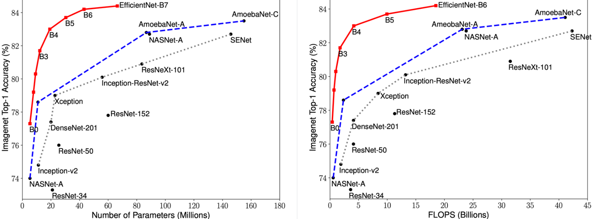
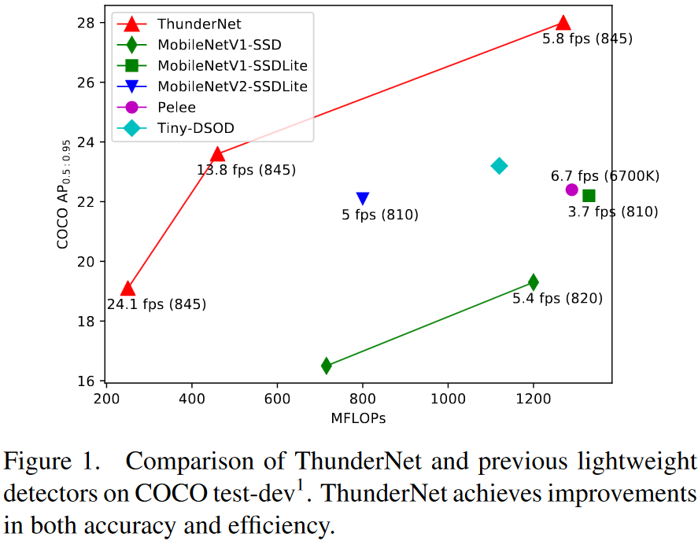

# Новые архитектуры нейросетей

**Under construction...**

Предыдущая статья «[Нейросети. Куда это все движется](https://habr.com/ru/post/482794/)»

TODO list:
  * Поищу новые архитектуры за март месяц на YouTube.
  * Посмотрю источники еще на [Papers With Code](https://paperswithcode.com).
  * Сделаю обзор статей из [этого списка](https://github.com/zhousy1993/paper). Может, что интересное будет.

В последние годы появилось множество новых архитектур нейронных сетей. Еще больше архитектур нейросетей не получили достаточной популярности, но имеют шансы стать популярными в ближайшем будущем. В этой статье кратко рассматриваются некоторые архитектуры нейросетей, чтобы найти (или хотя бы попытаться найти) будущие направления в этой быстро развивающейся области. *В последнее время исследователи экспериментируют с сетями, которые автоматически создают другие сети; с механизмом внимания.*

Статья не претендует на полноту охвата. Автор уверен, что пока писал эту статью, появилось еще много новых архитектур.

  - [EfficientNet](#EfficientNet)
  - [EfficientDet](#EfficientDet)
  - [SpineNet](#SpineNet)
  - [CenterNet](#CenterNet)
  - [ThunderNet](#ThunderNet)
  - [CSPNet](#CSPNet)
  - [DenseNet](#DenseNet)
  - [DetNASNet](#DetNASNet)
  - [SM-NAS](#SM-NAS)
  - [AmoebaNet](#AmoebaNet)
  - [Graph Neural Network](#GNN)
  - [Growing Neural Cellular Automata](#cellular_automata)
  - [Импульсная нейронная сеть](#spiking-nn)
  - [DPM](#DPM)
  - [Выводы](#conclusions)

[Object Detection in 20 Years](https://arxiv.org/pdf/1905.05055v2.pdf) - большой обзор нейросетей для обнаружения объектов за 20 лет на 400+ статей.

[The Neural Network Zoo](https://www.asimovinstitute.org/neural-network-zoo/) - зоопарк нейросетей, содержимое которого постоянно меняется.

Интересное видео с рекомендациями, как спроектировать нейронную сеть: «[How to Design a Neural Network](https://youtu.be/g2vlqhefADk)».

-------
## <a name="EfficientNet" />EfficientNet

**EfficientNet** — класс новых моделей, который получился из изучения масштабирования (скейлинг, scaling) моделей и балансирования между собой глубины и ширины (количества каналов) сети, а также разрешения изображений в сети. Авторы [оригинальной статьи](https://arxiv.org/abs/1905.11946) предлагают новый метод составного масштабирования (compound scaling method), который равномерно масштабирует глубину/ширину/разрешение с фиксированными пропорциями между ними. Из существующего метода под названием «Neural Architecture Search» ([NAS](https://en.wikipedia.org/wiki/Neural_architecture_search), [статья1](https://arxiv.org/abs/1611.01578), [статья2](https://arxiv.org/abs/1807.11626), [видео](https://youtu.be/gZZKjiAKc5s)) для автоматического создания новых сетей и своего собственного метода масштабирования авторы получают новый класс моделей под названием EfficientNets.

  * [оригинальная статья](https://arxiv.org/abs/1905.11946): «EfficientNet: Rethinking Model Scaling for Convolutional Neural Networks»
  * обзор оригинальной статьи [на русском](https://habr.com/ru/company/ods/blog/472672/#4-efficientnet-rethinking-model-scaling-for-convolutional-neural-networks)
  * [исходный код](https://github.com/tensorflow/tpu/tree/master/models/official/efficientnet) для TensorFlow
  * [видео1](https://youtu.be/3svIm5UC94I), [видео2.1](https://youtu.be/4U2WO8ObGGU), [видео2.2](https://youtu.be/LRpzb17B1BM), [видео3](https://youtu.be/K4XXS4Tn1Ow)

-------
## <a name="EfficientDet" />EfficientDet

**EfficientDet** применяется для обнаружения объектов. Архитектура показана на рисунке ниже. Состоит из [EfficientNet](#EfficientNet) в качестве основы, к которой приделан слой по работе с пирамидой признаков под названием BiFPN, за которым идет «стандартная» сеть вычисления класс/рамка объекта.

  * [оригинальная статья](https://arxiv.org/abs/1911.09070)
  * [исходный код](https://github.com/xuannianz/EfficientDet) для TensorFlow
  * [исходный код](https://github.com/toandaominh1997/EfficientDet.Pytorch) для PyTorch
  * [видео1](https://youtu.be/UCPxzFPdAf8)

Рисунок — Архитектура EfficientDet == EfficientNet + BiFPN + сеть вычисления класс/рамка

-------
## <a name="SpineNet" />SpineNet

**SpineNet** применяется для обнаружения объектов на изображении. Исследователи из Google Research достигли хороших результатов, которые превышают имеющиеся state-of-the-art (SOTA) подходы. 

Сверточные нейросети обычно кодируют входное изображение в последовательность промежуточных признаков меньшей размерности. Такой подход хорошо работает для задачи классификации изображений, но плохо работает для задачи распознавания объектов (распознавание и локализация). Для обхода ограничения сверточных сетей по локализации (сегментации) объектов применяются архитектуры инкодер-декодер (кодировщик-декодировщик) (Convolutional Encoder-Decoder Neural Network) с архитектурой типа «[песочные часы](https://medium.com/@sunnerli/simple-introduction-about-hourglass-like-model-11ee7c30138)». В архитектурах типа «песочные часы» декодировщик располагается поверх кодировщика. Таким образом кодировщик применяется для задач классификации, а декодировщик – для задач локализации. При этом кодировщик является основной моделью (backbone model) и как правило содержит больше параметров и потребляет больше вычислительных мощностей, чем декодировщик. Исследователи заявляют, что архитектура типа «песочные часы» неэффективна для генерации признаков *разных масштабов*, потому что в такой модели масштаб изображения постоянно уменьшается при помощи основной модели (кодировщика).

Предложенная модель SpineNet позволяет выучивать разномасштабные признаки из-за сверточных слоев смешанных размеров (смотрите рисунок ниже). Размеры слоев подбирались с помощью нейронного поиска архитектур (Neural Architecture Search, NAS). Использование SpineNet в качестве базовой модели дает прирост в точности (Average Precision, AP). При этом на обучение модели требуется меньше вычислительных ресурсов.

Рисунок – Построение моделей со смешанным масштабом с помощью перестановок слоев ResNet архитектуры (ResNet-50-FPN крайняя слева)

  * [оригинальная статья](https://arxiv.org/abs/1912.05027): SpineNet: Learning Scale-Permuted Backbone for Recognition and Localization
  * [обзор на русском](https://neurohive.io/ru/papers/spinenet-arhitektura-dlya-raspoznavaniya-i-lokalizacii-obekta-na-izobrazhenii/): SpineNet: архитектура для распознавания и локализации объекта на изображении
  * [SpineNet online demo](http://zeus.robots.ox.ac.uk/spinenet/demo.html)

-------
## <a name="CenterNet" />CenterNet

**CenterNet** а также **CornerNet-Lite** считаются мейнстримовыми (2019 год) системами обнаружения объектов. Статья «[Объекты как точки](https://arxiv.org/abs/1904.07850)»
  * [оригинальная статья](https://arxiv.org/abs/1808.01244) по CenterNet
  * [оригинальная статья](https://arxiv.org/abs/1904.08900) по CornerNet-Lite

-------
## <a name="ThunderNet" />ThunderNet

**ThunderNet** применяется для обнаружения объектов на изображении.
  * [оригинальная статья](https://arxiv.org/abs/1903.11752)

Рисунок — Архитектура ThunderNet

-------
## <a name="CSPNet" />CSPNet

**CSPNet** (**C**ross **S**tage **P**artial **Net**work) работает на фреймворке [Darknet](https://github.com/AlexeyAB/darknet). Метод применяется не сам по себе, а как *улучшение* уже существующих остаточных нейросетей (residual neural networks). Основная концепция в том, чтобы поток градиента распространялся по разным сетевым путям через разделения потока градиента. Таким образом распространяемая информация о градиенте может иметь большую корреляционную разницу, если переключать этапы конкатенации и перехода. Кроме того, CSPNet может значительно сократить объем вычислений и повысить скорость вывода и точность. Как видно из картинки выше, суть CSPNet в более сложной обработки [пирамид фичей](https://youtu.be/4SxOkIN0CmA?t=495) (feature pyramid network, [FPN](https://arxiv.org/abs/1612.03144)).
  * [оригинальная статья](https://arxiv.org/abs/1911.11929v1)
  * [исходный код](https://github.com/WongKinYiu/CrossStagePartialNetworks)

Рисунок — Пример пирамиды фичей

-------
## <a name="DenseNet" />DenseNet
DenseNet (Densely Connected Convolutional Network) была предложена в 2017 году. Успех ResNet (Deep Residual Network) позволил предположить, что укороченное соединение в CNN позволяет обучать более глубокие и точные модели. Авторы проанализировали это наблюдение и представили компактно соединенный блок, который соединяет каждый слой с каждым другим слоем.
  * [оригинальная статья](https://arxiv.org/abs/1608.06993)

-------
## <a name="DetNASNet" />DetNASNet

**DetNASNet** — 
  * [оригинальная статья](https://arxiv.org/abs/1903.10979)
  * [исходный код](https://github.com/megvii-model/DetNAS)

-------
<a name="SM-NAS" />SM-NAS

**SM-NAS** — 
  * [оригинальная статья](https://arxiv.org/abs/1911.09929)

-------
## <a name="AmoebaNet" />AmoebaNet

**AmoebaNet** — также относится к алгоритмам по автоматическому созданию нейросетей. AmoebaNet использует [эволюционные алгоритмы](https://ru.wikipedia.org/wiki/%D0%AD%D0%B2%D0%BE%D0%BB%D1%8E%D1%86%D0%B8%D0%BE%D0%BD%D0%BD%D1%8B%D0%B5_%D0%B0%D0%BB%D0%B3%D0%BE%D1%80%D0%B8%D1%82%D0%BC%D1%8B) вместо алгоритмов обучения с подкреплением для автоматического поиска оптимальных архитектур нейросетей. AmoebaNet использует то же простарство поиска (search space), что и NASNet. Является очень затратной по вычислениям и использует сотни TPU (Tensor Processing Units) для вычислений.
  * [оригинальная статья](https://arxiv.org/abs/1802.01548): «Regularized Evolution for Image Classifier Architecture Search»
  * [исходный код](https://github.com/tensorflow/tpu/tree/master/models/official/amoeba_net)

-------
## <a name="GNN" />Graph Neural Network

**Graph Neural Network** или **нейронная сеть на графе**, где искусственные нейроны — это узлы графа, а соединения между нейронами — это ребра графа. Очень полезны для решения задач машинного обучения на графах. А на графах можно сделать очень многое и даже прововодить обработку изображений. Наиболее популярные библиотеки для машинного обучения на графах: [PyTorch Geometric](https://github.com/rusty1s/pytorch_geometric) для PyTorch, [Graph Nets](https://github.com/deepmind/graph_nets) для TensorFlow, [Deep Graph](https://www.dgl.ai) самая удобная для начала.
  * [простой пример](https://colab.research.google.com/drive/1-lGZyrCaNwq1ub8qdH4_g19erjFz3tU-) в CoLab
  * [видео](https://youtu.be/bA261BF0bdk) by Siraj Raval
  * [документация](https://docs.dgl.ai/tutorials/basics/1_first.html) библиотеки DGL (**D**eep **G**raph **L**ibrary)

-------
## <a name="cellular_automata" />Growing Neural Cellular Automata

**Growing Neural Cellular Automata** — 
  * [видео](https://youtu.be/9Kec_7WFyp0) by Yannic Kilcher

-------
## <a name="spiking-nn" />Импульсная нейронная сеть

**Импульсная нейронная сеть** или **Spiking neural network**
  * [Википедия](https://ru.wikipedia.org/wiki/%D0%98%D0%BC%D0%BF%D1%83%D0%BB%D1%8C%D1%81%D0%BD%D0%B0%D1%8F_%D0%BD%D0%B5%D0%B9%D1%80%D0%BE%D0%BD%D0%BD%D0%B0%D1%8F_%D1%81%D0%B5%D1%82%D1%8C)

Первая научная модель импульсной нейросети была предложена еще в 1952 году Аланом Ходжкином и Эндрю Хаксли, однако данный вид искусственных нейронных сетей известен немногим специалистам в этой области.

-------
## <a name="DPM" />DPM

**DPM**, **D**eformable **P**art **M**odel detector, **не** нейросеть. Была популярна при обнаружении пешеходов где-то в 2009 году, а затем, как пишут [в этой статье](https://arxiv.org/pdf/1905.05055v2.pdf), уступила первенство алгоритму Integral Channel Features ([ICF](https://pages.ucsd.edu/~ztu/publication/dollarBMVC09ChnFtrs_0.pdf)).
  * [Object Detection with Discriminatively Trained Part Based Models](http://cs.brown.edu/people/pfelzens/papers/lsvm-pami.pdf)
  * [Object Detection with Grammar Models](http://people.cs.uchicago.edu/~rbg/papers/grammar-nips11.pdf)
  * [30Hz Object Detection with DPM V5](http://citeseerx.ist.psu.edu/viewdoc/download?doi=10.1.1.703.7588&rep=rep1&type=pdf)
  * [видео демо](https://youtu.be/3LGGMe1wZGY)
  * [интерактивная статья](https://distill.pub/2020/growing-ca/)
  * игра [«Жизнь»](https://ru.wikipedia.org/wiki/%D0%98%D0%B3%D1%80%D0%B0_%C2%AB%D0%96%D0%B8%D0%B7%D0%BD%D1%8C%C2%BB)

-------
## <a name="conclusions" />Выводы
Видны усилия исследователей в направлении:
   * «нейросеть генерирует нейросеть»;
   * автоматический поиск оптимальных параметров нейросети;
   * механизм внимания (attention mechanism).

Спасибо за внимание!

**Теги:** машинное обучение, machine learning, нейросеть, искусственная нейронная сеть, artificial neural network, глубокое обучение, deep learning, Data Science, обработка изображений, искусственный интеллект, 

**Хабы:** машинное обучение, обработка изображений, искусственный интеллект, Data Science, глубокое обучение,
