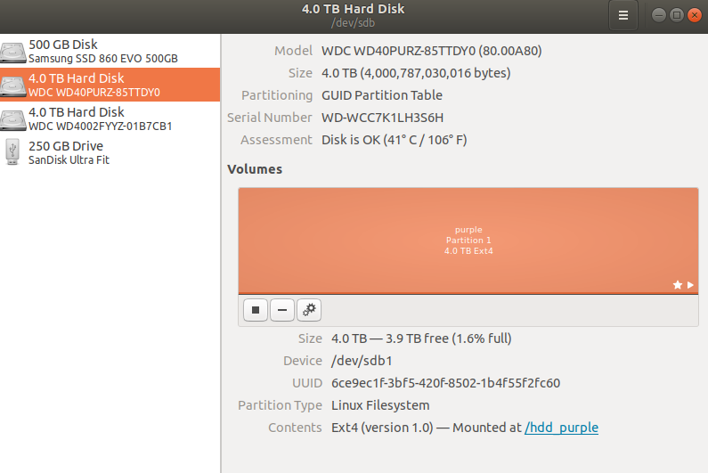

   - [Task](#task)
   - [Related links](#links)
   - [Format disks](#format)
   - [Permanently mount disks](#mount)
   - [Moving HOME from command line](#home)

---
### <a name="task" />Task
   - Drive check and format two HDDs: *WD Purple* and *WD Gold*.
   - Mount two HDDs to Ubuntu file system.
   - Move HOME folder to *WD Gold* HDD.

My answer on AskUbuntu.com: https://askubuntu.com/a/1097160/672237

---
### <a name="links" />Related links
   - [Terminal method of formatting storage drive](https://askubuntu.com/a/517365/672237)
   - [Add additional HDD in Ubuntu](https://askubuntu.com/a/956516/672237)
   - [Move home folder to second drive](https://askubuntu.com/a/50539/672237)

---
### <a name="format" />Format disks

Plug in all necessary SATA and power cables to your HDDs. Load Ubuntu.
Press `<Win>` keyboard and type "*Disks*".

*Disks* utility will be opened:



In this utility you could format your HDDs into `Ext4` file system.
Otherwise to format disks use commands:
   1. `fdisk`, `man fdisk`
   2. `parted`, `man parted`
   3. `mkfs`, `man mkfs`

```shell
sudo mkfs.ext4 -L purple /dev/sdb  # unsure about parameters, because used GUI "Disks"
sudo mkfs.ext4 -L gold   /dev/sdc  # unsure about parameters, because used GUI "Disks"
```

:exclamation: **Formatting will delete everything on your hard disk.** :exclamation:

You can skip this step if there are any data on the hard disk
and you want to not lose it.

Slow formatting should take a lot of time. From 16 upto 20 hours for 4 TB disk.

---
### <a name="mount" />Permanently mount disks

Press `<CTRL>+<ALT>+<T>` keys and open a console.

```shell
# Check your /dev/sdb and /dev/sdc discs are visible
lsblk

# Create two directories for HDDs: "WD Purple" and "WD Gold"
sudo mkdir /hdd_purple
sudo mkdir /hdd_gold  # temporary directory

# Temporary mount to the new mount point
sudo mount /dev/sdb1 /hdd_purple
sudo mount /dev/sdc1 /hdd_gold

# Unmount drives
sudo umount /dev/sdb1
sudo umount /dev/sdc1

# Change permissions for goups and other
sudo chmod go+rx /hdd_purple
# Change owner to root
sudo chown root:root /hdd_purple
# Check it
ls -hal /
```

Configuration file `/etc/fstab` has list of all partitions
that will be mounted at boot (permanently).

   1. Get UUID of HDD and backup `/etc/fstab` file.

```shell
# 1. Show and copy UUID of the HDD with this command:
sudo blkid
```

My data is:

```shell
/dev/sdb1: LABEL="purple" UUID="6ce9ec1f-3bf5-420f-8502-1b4f55f2fc60" TYPE="ext4" PARTUUID="a14c8357-a8ce-42e4-9772-64ccfad3e226"
/dev/sdc1: LABEL="gold" UUID="1d049c7c-4565-480b-a181-2459e8ff8c1b" TYPE="ext4" PARTUUID="4c691b21-b4e3-4dab-ab91-d7bf7272b2b5"
```

Make a backup of `/etc/fstab` file to be able to revert changes.

```shell
# Make backup
sudo cp /etc/fstab /etc/fstab.2018.11.29.bak
```

   2. Add a new partitions by editing `/etc/fstab` file as root.

```shell
# Edit /etc/fstab
sudo nano /etc/fstab

# At the bottom of fstab file add 2 lines similar to this:
UUID=6ce9ec1f-3bf5-420f-8502-1b4f55f2fc60   /hdd_purple   ext4   defaults           0  2
UUID=1d049c7c-4565-480b-a181-2459e8ff8c1b   /hdd_gold     ext4   defaults           0  2
```

**Your UUID is different.**

Write the file with keys `<Ctrl>+<O>` then hit `<Return>`.
Quit the editor with `<Ctrl>+<X>`.

If you have *Midnight Commander* running, then save before quitting with
`<Ctrl>+<X>`, because `<Ctrl>+<O>` will switch from `nano` editor to your *MC*.

   3. Check and reboot

To see if the drive is mounted correctly we can simulate the mount process
at boot.

```shell
# Simulate the mount process
sudo mount -a
# Reboot
sudo reboot
```

---
### <a name="home" />Moving HOME from command line

To avoid side effects while working in a graphical environment,
perform all actions to move `$HOME` directory from a terminal with
`<Ctrl>+<Alt>+<F3>` hotkeys pressing.

Press `<Ctrl>+<Alt>+<F3>` hotkeys and switch to console mode.
Login in the console mode.

```shell
# Copy /home directory to the new location
sudo rsync -avx /home/ /hdd_gold

# Check if everything is copied correctly
ls -hal /hdd_gold

# Delete everything in the /home directory
# Be careful with this command, make sure you have a backup.
rm -rf /home/*

# Make $HOME permanent -- edit /etc/fstab configuration file
sudo nano /etc/fstab

# Change string
UUID=1d049c7c-4565-480b-a181-2459e8ff8c1b  /hdd_gold  ext4  defaults  0  2
# to string
UUID=1d049c7c-4565-480b-a181-2459e8ff8c1b  /home      ext4  defaults  0  2
# I.e. change /hdd_golds to /home

# After a reboot, your /home resides on the new drive having plenty of space.
sudo reboot
```
