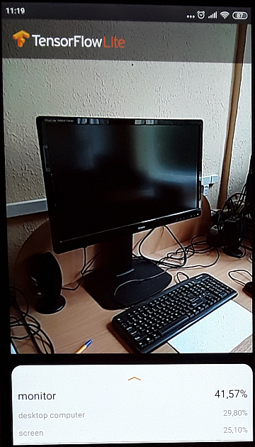
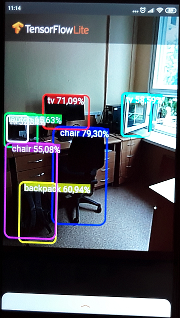

   - [Exercises and tutorials](#exercises)
   - [All video courses and tutorials](#video-courses)
   - [Code examples](#code-examples)
   - [Additional useful tools](#tools)
   - [TensorFlow for Android](#tensorflow-for-android)
   - [TensorFlow CPUs and GPUs Configuration](#cpu-gpu-configuration)
      - [Limit TensorFlow to one GPU](#limit-gpu)
      - [Limit TensorFlow to lower memory](#limit-memory)
         - [1. Reserve dynamically](#reserve-dynamically)
         - [2. Reserve fixed fraction](#reserve-fraction)
      - [Turn off debug messages](#debug-messages)
      - [Clean up resources and exit](#clean-up)
         - [Forcibly clean up resources](#force-clean)

---
### <a name="exercises" />Exercises and tutorials

Helpful for me and I hope will be helpful for you:

   * How to write a scientific (survey) paper: [part1](https://youtu.be/FupqqW3hZWQ) & [part2](https://youtu.be/aeea2Xw237U) --
     Before learning Machine Learning, you must know how to write survey (scientific) paper
     and how to work with survey papers.   
   * [#AskTensorFlow](https://www.youtube.com/playlist?list=PLQY2H8rRoyvypL1nu_65Uhf5LuWlZdmSL) --
     Answers on frequently asked questions about TensorFlow. Useful answers for beginners.
   * [TensorFlow free course](https://classroom.udacity.com/courses/ud187) --
     <b>Highly recommend</b> this course to ML newcomers, beginners, novices, rookies, etc.
   * [Get Started with TensorFlow](https://www.tensorflow.org/tutorials) --
     Webpage with many tutorials. Everyone should make at least 5 exercises for beginners
     and then continue with more advanced tutorials.
   * [Neural Networks Demystified](https://www.youtube.com/playlist?list=PLiaHhY2iBX9hdHaRr6b7XevZtgZRa1PoU) --
     Intro into neural networks
     with the [source code](https://github.com/stephencwelch/Neural-Networks-Demystified).
   * [A Neural Network in 11 lines of Python (Part 1)](http://iamtrask.github.io/2015/07/12/basic-python-network) --
     Simple neural network in 11 lines of Python code with detailed explanation
     and [Russian translation is here](https://habr.com/ru/post/271563).
   * [A Neural Network in 13 lines of Python (Part 2 - Gradient Descent)](https://iamtrask.github.io/2015/07/27/python-network-part2) --
     Explanation of gradient descent with 13 lines of Python code.
   * [Create A Neural Network That Classifies Diabetes Risk In 15 Lines of Python](https://youtu.be/T91fsaG2L0s) --
     Neural network in 15 lines of Python code to diagnose diabetes.
     Russian translation [here](file:///D:/Pavlenko/%23_%D0%9F%D1%80%D0%BE%D0%B5%D0%BA%D1%82%D1%8B/Python/2019.02.25_ML_study/2019.02.27%20Diabetes/%D0%9D%D0%B5%D0%B9%D1%80%D0%BE%D0%BD%D0%BD%D0%B0%D1%8F%20%D1%81%D0%B5%D1%82%D1%8C%20%D0%BD%D0%B0%20Python%20%D0%B2%2015%20%D1%81%D1%82%D1%80%D0%BE%D0%BA%20%D0%BA%D0%BE%D0%B4%D0%B0%20%D0%B4%D0%BB%D1%8F%20%D0%B4%D0%B8%D0%B0%D0%B3%D0%BD%D0%BE%D1%81%D1%82%D0%B8%D0%BA%D0%B8%20%D0%B4%D0%B8%D0%B0%D0%B1%D0%B5%D1%82%D0%B0.html).
     Text explanations are [here](https://www.andreagrandi.it/2018/04/14/machine-learning-pima-indians-diabetes/).
     CSV database file is [here](https://www.kaggle.com/uciml/pima-indians-diabetes-database).
   * [Unsupervised Learning by Siraj Raval](https://youtu.be/8dqdDEyzkFA) --
     Using signal processing and K-means clustering to extract and sort neural events in Python plus
     [source code](https://github.com/llSourcell/spike_sorting)
     and [dataset](http://www.vis.caltech.edu/~rodri/Wave_clus/UCLA_data.zip).
   * [Unet Segmentation in Keras](https://youtu.be/M3EZS__Z_XE) --
     Easy explanation of the U-net in Keras
     with the [source code](https://github.com/nikhilroxtomar/UNet-Segmentation-in-Keras-TensorFlow/blob/master/unet-segmentation.ipynb).
   * [Deep Residual Unet Segmentation in Keras](https://youtu.be/BOoBWRTpaKk) --
     Easy explanation of the ResUNet in Keras
     with the [source code](https://github.com/nikhilroxtomar/Deep-Residual-Unet/blob/master/Deep%20Residual%20UNet.ipynb).
   * Course [Introduction to TensorFlow for AI, ML, and DL](https://www.coursera.org/learn/introduction-tensorflow/home/welcome) --
     Good introduction course into TensorFlow.
   * Course [Coding TensorFlow](https://www.youtube.com/playlist?list=PLQY2H8rRoyvwLbzbnKJ59NkZvQAW9wLbx) --
     You will look at various parts of TensorFlow from a coding perspective.
   * Tips [TensorFlow Tip of the Week](https://www.youtube.com/playlist?list=PLQY2H8rRoyvxso6rsvcDeMzekGuLxbTEB) --
     How to best use TensorFlow open source machine learning platform.

---
### <a name="video-courses" />All video courses and tutorials

All video courses and tutorials about Machine Learning I'm working on
[are placed here](../Machine_Learning/courses_on_machine_learning.md).

---
### <a name="code-examples" />Code examples

All code examples are placed [here](../Machine_Learning/code_examples).

---
### <a name="tools" />Additional useful tools

Additional useful tools everybody should know about:
   * [Six easy ways](https://www.dataschool.io/cloud-services-for-jupyter-notebook)
     to run your Jupyter Notebook in the cloud:
         [Binder](https://mybinder.org),
         [Kaggle Kernels](https://www.kaggle.com),
         [Google Colaboratory (Colab)](https://colab.research.google.com),
         [Microsoft Azure Notebooks](https://notebooks.azure.com),
         [CoCalc](https://cocalc.com),
         [Datalore](https://datalore.io)
   * [Google Colab](https://colab.research.google.com) --
     Colaboratory is a free Jupyter notebook environment that requires no setup and runs entirely
     in the cloud. With Colaboratory you can write and execute code, save and share your analyses,
     and access powerful computing resources, all for free from your browser.
   * [Kaggle Kernels](https://www.kaggle.com/kernels) --
     Free Jupyter notebook environment. If you tired to [read documentation](https://www.kaggle.com/docs/kernels),
     just try to find and see some [videos](https://youtu.be/sLAthlX816c).
   * [Fatkun Batch Download Image add-on for Chrome browser](https://chrome.google.com/webstore/detail/fatkun-batch-download-ima/nnjjahlikiabnchcpehcpkdeckfgnohf) —
     Fast and easy download of many images from Google Images. Menu
     _"Ask where to save each file before downloading"_ must be turned off before downloading images.
   * [google_images_download](https://pypi.org/project/google_images_download) is a Python
     [Script](https://github.com/hardikvasa/google-images-download)
     for "searching" and "downloading" hundreds of Google images to the local hard disk.
   * [Google Dataset Search](https://toolbox.google.com/datasetsearch) is a search engine for datasets.
   * [Awesome Public Datasets](https://github.com/awesomedata/awesome-public-datasets)
     list of a topic-centric public data sources.
   * [Hands-on TensorBoard (TensorFlow Dev Summit 2017)](https://youtu.be/eBbEDRsCmv4) --
     Demonstration of TensorBoard tool with the
     [source code](https://github.com/martinwicke/tf-dev-summit-tensorboard-tutorial).
   * [K3D Jupyter](https://github.com/K3D-tools/K3D-jupyter) --
     Jupyter notebook extension for *3D visualization*
     with [examples](https://github.com/K3D-tools/K3D-jupyter/tree/master/examples).
     Just start to view the examples and you'll like it :-)
   * [Juxtapose](https://juxtapose.knightlab.com/) --
     Easy-to-make frame comparisons. Useful for presentations.
     Generate an embedable code snippet that you can use on any website or Jupyter notebook.
     There must be an Internet connection to obtain URL.
     Copy-paste code below into your Jupyter notebook and replace the `url`:

```python
# Display the associated webpage in a new window
import IPython
url = 'https://cdn.knightlab.com/libs/juxtapose/latest/embed/index.html?uid=7e8015a0-4be7-11e9-8106-0edaf8f81e27'
iframe = '<iframe frameborder="0" class="juxtapose" width="100%" height="600" src="' + url + '"></iframe>'
IPython.display.HTML(iframe)
```

   * [Deep Learning add-on for Adaptive Vision Studio Lite](https://www.adaptive-vision.com/en/software/deep-learning) --
     If you need out-of-the-box solutions, you could try Adaptive Vision tool with Deep Learning add-on.
     Unfortunately, Deep Learning add-on has only trial version for 30 days for educational purposes.
     [Lite version](https://www.adaptive-vision.com/en/software/editions)
     is a limited-functionality freeware available for trial and non-commercial use.
     Recommended especially for students who want to learn how to develop
     complex algorithms with images loaded from files.
   * [nbviewer](https://nbviewer.jupyter.org/) -- A simple way to share Jupyter Notebooks.
     It is useful if your Jupyter Notebook `*.ipynb` won't load on Github.
     Enter the location of a Jupyter Notebook to have it rendered.
   * Annotation tool [labelImg](https://tzutalin.github.io/labelImg).
     This annotation tool supports both Windows and Linux, it will generate `xml` files inside
     image directories. Tip: use shortcuts (`w`: draw box, `d`: next file, `a`: previous file, etc.)
     to accelerate the annotation.
   * My own annotation tools: [Manual image annotation with polygons](https://github.com/foobar167/junkyard/tree/master/manual_image_annotation1)
     and [Manual image annotation with rectangles](https://github.com/foobar167/junkyard/tree/master/manual_image_annotation2)
     can annotate and cut rectangular images.
   * Resize multiple images with [`resize_images.py`](https://github.com/foobar167/junkyard/blob/master/simple_scripts/resize_images.py)
     script.
   * [VGG Image Annotator](http://www.robots.ox.ac.uk/~vgg/software/via/)
     is a simple and standalone manual annotation software for image, audio and video.
     VIA [runs in a web browser](http://www.robots.ox.ac.uk/~vgg/software/via/via.html)
     and does not require any installation or setup.
     The complete VIA software fits in a single self-contained HTML page of size less than 400 Kilobyte
     that runs as an offline application in most modern web browsers.

---
### <a name="tensorflow-for-android" />TensorFlow for Android

For iOS review [this blog](https://machinethink.net/blog/) of Matthijs Hollemans.

[TensorFlow Lite guide](https://www.tensorflow.org/lite/guide) — this is your starting point.

Video course [Introduction to TensorFlow Lite](https://www.udacity.com/course/intro-to-tensorflow-lite--ud190).

TensorFlow Lite **vs** TensorFlow Mobile ([link](https://towardsdatascience.com/the-essential-guide-to-learn-tensorflow-mobile-and-tensorflow-lite-a70591687800)):
   * Lite is the next version of Mobile. Generally, applications developed on Lite
   will have better performance and less binary file size than Mobile.
   * Lite is still in early stages so not all the cases cover which is not the case for Mobile.
   * Lite supports selective sets of operators, therefore not all the models will work on Lite by default.
   Whereas, Mobile has fully covered functionality.

I'm not familiar with Android development. So start with [Android quickstart](https://www.tensorflow.org/lite/guide/android)
and Android **image classification** [example](https://github.com/tensorflow/examples/tree/master/lite/examples/image_classification/android):
   * Download and install [Android Studio](https://developer.android.com/studio).
   * Set device in [developer mode](https://developer.android.com/studio/debug/dev-options) with USB debugging enabled.
Enable developer mode and USB debugging on [Xiaomi Redmi](https://www.syncios.com/android/how-to-debug-xiaomi-redmi-phone.html)
or [Samsung Galaxy Tab](https://www.getdroidtips.com/enable-options-usb-debugging-galaxy-tab-s3-9-7).
Google it to set developer and debugging on other phone models.
   * Take USB cable (to connect Android device to your computer).

[Configuration steps](https://stackoverflow.com/a/48524656/7550928) for **MIUI 9 and above**:
*Settings → Additional Settings → Developer options →*
   01. Turn off `Turn on MIUI optimization` at the very bottom of `Developer options`
       and **Restart** the phone.
   02. Turn On `USB Debugging`.
   03. Turn On `Install via USB`.
   04. Set USB Configuration to Charging.
       MTP(Media Transfer Protocol) is the default mode. Works even in MTP in some cases.

After finishing previous example run **object detection** [example](https://github.com/tensorflow/examples/tree/master/lite/examples/object_detection/android)
using a quantized [MobileNet SSD](https://github.com/tensorflow/models/tree/master/research/object_detection)
model trained on the [COCO dataset](http://cocodataset.org/#explore).

Result for image classification demo is **decent** (2019.09.13). I don't know which dataset they used,
but the quality of classification is decent.



Result for object detection is **poor** (2019.09.13, COCO dataset). It is not for production.



For further Android development examples and TensorFlow Lite,
visit [this repository](https://github.com/foobar167/android).

---
### <a name="cpu-gpu-configuration" />TensorFlow CPUs and GPUs Configuration

Links to read:
   * [TensorFlow CPUs and GPUs Configuration](https://medium.com/@lisulimowicz/tensorflow-cpus-and-gpus-configuration-9c223436d4ef)
   * [Using GPUs](https://www.tensorflow.org/guide/using_gpu)
   * [How to prevent tensorflow from allocating the totality of a GPU memory](https://stackoverflow.com/questions/34199233/how-to-prevent-tensorflow-from-allocating-the-totality-of-a-gpu-memory)
   * [How can I flush GPU memory using CUDA (physical reset is unavailable)](https://stackoverflow.com/questions/15197286/how-can-i-flush-gpu-memory-using-cuda-physical-reset-is-unavailable)

---
#### <a name="limit-gpu" />Limit TensorFlow to one GPU

By default TensorFlow occupies all GPUs on the platform.
Also you should exit Python (ipython, jupyter) console to free GPU resources. 

```python
# Calculate on the 2nd GPU
import os
os.environ["CUDA_DEVICE_ORDER"] = "PCI_BUS_ID"  # so the IDs match nvidia-smi
os.environ["CUDA_VISIBLE_DEVICES"] = "1"        # "0,1" for multiple GPU or "-1" for CPU

# Note: it seems option "0,1" does not work for different GPU models.
```

```shell
# For Jupyter Notebook one has to restart the kernel
# after changing of environment variables.

# Monitor GPU permanently. To exit, press <Ctrl>+<C> keys.
watch -n 0.5 nvidia-smi
# Monitor CPU permanently. To exit, press <Q> key.
htop
```

---
#### <a name="limit-memory" />Limit TensorFlow to lower memory

By default TensorFlow occupies all memory on GPU.

##### <a name="reserve-dynamically" />1. Reserve dynamically

You can dynamically reserve only necessary, but not all available memory:

```python
# Reserve necessary GPU memory
import tensorflow as tf

config = tf.ConfigProto()
config.gpu_options.allow_growth=True  # dynamically grow the memory used on the GPU  
sess = tf.Session(config=config)

# For TensorFlow 2.0 Alpha and beyond
tf.config.gpu.set_per_process_memory_growth()
```

##### <a name="reserve-fraction" />2. Reserve fixed fraction

You can set the fraction of GPU memory to be allocated when you construct a `tf.Session`
by passing a `tf.GPUOptions` as part of the optional config argument:

```python
# Reserve GPU memory fraction
import tensorflow as tf

# Assume that you have 12GB of GPU memory and want to allocate ~4GB:
gpu_options = tf.GPUOptions(per_process_gpu_memory_fraction=0.333)
sess = tf.Session(config=tf.ConfigProto(gpu_options=gpu_options))

# or (the same)
config = tf.ConfigProto()
config.gpu_options.per_process_gpu_memory_fraction = 0.333  # set fixed fraction of memory
session = tf.Session(config=config)

# For TensorFlow 2.0 Alpha and beyond
tf.config.gpu.set_per_process_memory_fraction(0.333)
```
The `per_process_gpu_memory_fraction` acts as a hard upper bound on the amount of GPU memory
that will be used by the process on each GPU on the same machine.
Currently, this fraction is applied uniformly to all of the GPUs on the same machine

---
#### <a name="debug-messages" />Turn off debug messages

```python
import os
import tensorflow as tf

# 0 - all messages are logged (default behavior)
# 1 - INFO messages are not printed
# 2 - INFO and WARNING messages are not printed
# 3 - INFO, WARNING, and ERROR messages are not printed
os.environ['TF_CPP_MIN_LOG_LEVEL'] = '2'  # show errors
```

---
#### <a name="clean-up" />Clean up resources and exit

After calculations **everyone should clean up resources** and exit from Python, iPython and Jupyter.
Place this code at the end of your program:
```python
# Clean up resources. Place this code at the end of the program.
import os, signal
os.kill(os.getpid(), signal.SIGTERM)  # you can use signal.SIGKILL for Linux, but not for Windows
```

##### <a name="force-clean" />Forcibly clean up resources

Root can forcibly clean up resources:
```shell
sudo fuser -v /dev/nvidia*

                     USER         PID ACCESS COMMAND
/dev/nvidia0:        root        4051 F...m Xorg
                     username1   8138 F...m python
                     username2  11791 F.... python3
                     username3  14282 F...m python3
                     username3  14295 F...m python3
/dev/nvidia1:        root        4051 F...m Xorg
                     username1   8138 F...m python
                     username2  11791 F...m python3
/dev/nvidiactl:      root        4051 F...m Xorg
                     username1   8138 F...m python
                     username2  11791 F...m python3
                     username3  14282 F...m python3
                     username3  14295 F...m python3
/dev/nvidia-modeset: root        4051 F.... Xorg
/dev/nvidia-uvm:     username1   8138 F...m python
                     username2  11791 F.... python3
                     username3  14282 F...m python3
                     username3  14295 F...m python3

# Finish 2 processes for nvidia0
sudo kill -9 14282
sudo kill -9 14295

sudo fuser -v /dev/nvidia*
nvidia-smi
```
